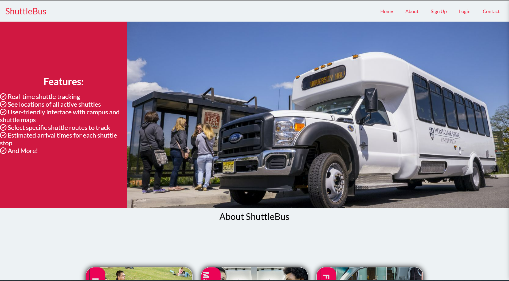

  

<h3 align="center">ShuttleBus</h3>
 

  

---

 Software Engineering II Class Project
      

## 🧐 About 

Shuttlebus is an all in one shuttle mangemnet software to track where shuttles are around campus. Allows users to track the live location of shuttles using the Google Map JS API

## Image of ShuttleBus Homepage
</a>
